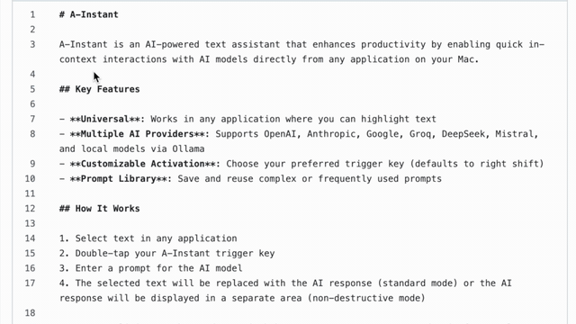

# A-Instant

A-Instant is an AI-powered text assistant that enhances productivity by enabling quick in-context interactions with AI models directly from any application on your Mac.

## Key Features

- **Universal**: Works in any application where you can highlight text
- **Multiple AI Providers**: Supports OpenAI, Anthropic, Google, Groq, DeepSeek, Mistral, and local models via Ollama
- **Customizable Activation**: Choose your preferred trigger key (defaults to right shift)
- **Prompt Library**: Save and reuse complex or frequently used prompts

## How It Works

1. Select text in any application
2. Double-tap your A-Instant trigger key
3. Enter a prompt for the AI model
4. The selected text will be replaced with the AI response (standard mode) or the AI response will be displayed in a separate area (non-destructive mode)

A-Instant eliminates the need to switch between apps, copy/paste, and wait for results. Simply highlight, double-tap, and you're done!

## Examples

### Standard Mode
In this mode, the selected text is replaced with the AI response.

### Non-Destructive Mode
In this mode, the AI response is displayed in a separate area without modifying the original text.

## Installation

### Requirements
- macOS 14.0 or later
- Access to an AI provider API (OpenAI, Anthropic, Google, Groq, DeepSeek, Mistral) or Ollama running locally

### Steps
1. Download the latest release from the [Releases page](https://github.com/poliva/a-instant/releases)
2. Unzip the file (macOS usually does this automatically)
3. Move the app to your Applications folder
4. When prompted, grant accessibility permissions in System Settings > Privacy & Security > Accessibility

## Usage

### Setup
1. Open A-Instant settings from the menu bar icon
2. Configure your AI provider and API key
3. Choose your trigger key if you don't want to use right shift

### Using A-Instant
1. Select text in any application
2. Double-tap your trigger key
3. Enter your prompt in the popup window
4. In standard mode: The selected text will be replaced with the AI response
5. In non-destructive mode: The AI response will be displayed below your prompt, with options to copy or clear

## License

MIT
